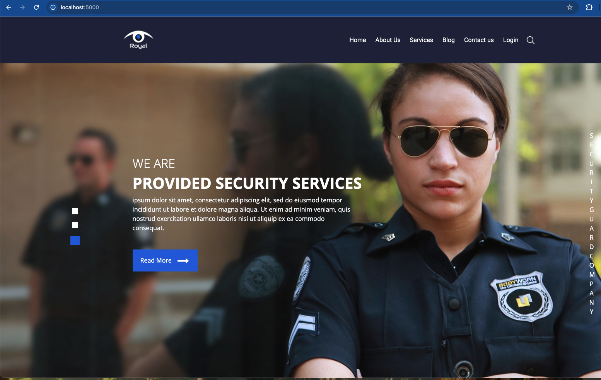

# 🚀 AWS Fargate Deployment for cley-vul-app

This Terraform configuration deploys the [cley-vul-app](https://github.com/cleypanw/cley-vul-app) container on **AWS Fargate**, with public access via an **Application Load Balancer (ALB)**.

---

## 📦 What It Does

- Creates a new **VPC** with two public subnets (in `eu-west-3a` and `eu-west-3b`)
- Sets up routing and internet access with an **Internet Gateway**
- Creates **IAM roles**, **security groups**, and an **ECS Cluster**
- Registers an **ECS Fargate Task** running the image:  
  `chrisley75/cley-vul-app:1.0.0`
- Deploys an **ECS Service** to run the task behind an ALB on port **80**
- Exposes outputs such as:
  - Public web URL of the app
  - ECS Cluster name
  - ECS Service name
  - Task Definition ARN

---

## 📁 Location in Repository

This Terraform code is located at terraform/fargate-deployment/

---

## 🛠️ Prerequisites

- [Terraform](https://www.terraform.io/downloads.html) v1.0+
- [AWS CLI](https://aws.amazon.com/cli/) configured with credentials
- An AWS account with permission to create VPC, ECS, ALB, IAM roles, etc.

---

## 🚀 Deployment Steps

1. **Clone the repository**

```bash
git clone https://github.com/cleypanw/cley-vul-app.git
cd cley-vul-app/terraform/fargate-deployment
```

2. **Initialize Terraform**

```bash
terraform init
```

3. **Review the execution plan (optional)**

```bash
terraform plan
```


4. **Apply the configuration**

```bash
terraform apply
```
Confirm with yes when prompted.

## 🌐 Access the App
After successful deployment, Terraform will output the public URL of the app:

```bash
Outputs:

webapp_url = "http://<load-balancer-dns>.eu-west-3.elb.amazonaws.com"
```

**Open the webapp_url in your browser to view the cley-vul-app**

